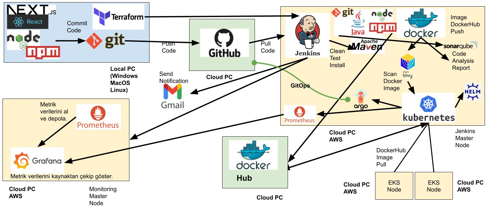

# DevOps Pipeline

## CI/CD Evreni

```

CI/CD:           (Jenkins, Git,  GitHub, GitOps,  GitHub Actions,    GitLab, GitLab CI,    Bitbucket, Bamboo)
Scripting        (Python, Bash, PowerShell)
Containers:      (Docker)
Orchestration:   (Kubernetes, Helm, ArgoCD)
Cloud            (AWS, Azure, GCP)
Virtualization:  (VMware, VirtualBox)
IaC:             (Terraform, Ansible, CloudFormation)
Monitoring:      (Prometheus, Grafana, ELK)
```
<hr>



#### ReactJS - [Next.js](https://nextjs.org) project [`create-next-app`](https://nextjs.org/docs/app/api-reference/cli/create-next-app).

```bash
npm run dev
```

http://localhost:3000

<hr>

##  1. Makine: Jenkins Master Node

```bash
aws configure
```


```
java --version
docker --version
jenkins --version
trivy --version
sonar-scanner --version
```

### Docker'da tüm containerları listeledik.
```
docker ps -a
```

```
docker stop CONTAINER_ID
docker start CONTAINER_ID

docker ps -a
```

#### SonarQube için Jenkins makinesinin PUBLIC_IP'sini alıp 9000 portuna gideceğiz.

http://PUBLIC_IP:9000


#### React için Jenkins makinesinin PUBLIC_IP'sini alıp 3000 portuna gideceğiz.

http://PUBLIC_IP:3000


#### Jenkins için Jenkins makinesinin PUBLIC_IP'sini alıp 8080 portuna gideceğiz.

http://PUBLIC_IP:8080

```
sudo cat /var/lib/jenkins/secrets/initialAdminPassword
```


SonarQube aracını Jenkins'e tanıtmak için Token oluşturuyoruz.

http://SONARIN_KURULU_OLDUGU_MAKINENIN_PUBLIC_IP:9000/admin/users


SonarQube aracını Jenkins'e tanıtmak için Token oluşturuyoruz.

http://SONARIN_KURULU_OLDUGU_MAKINENIN_PUBLIC_IP:9000/admin/users


SonarTokenForJenkins
squ_AAAAAAAAAAAA


SonarQubeQualityGates


http://3.233.45.51:9000/admin/webhooks

Create Webhook
http://3.233.45.51:8080/sonarqube-webhook

Proje adı oluşturduk.
Projeye özel webhook oluşturulur.
sonarqube-webhook
http://3.233.45.51:8080/sonarqube-webhook


DockerHub'a gidip Docker Token oluştur.
MyDockerHubTokenForAWS
```
docker login -u YOUR_USERNAME -p  dckr_BBBBBBBBBBB
```


Jenkins'e DockerHub'ın Token'ınını tanıt.

dockerhub


## 2. Makineyi MontitoringServer Terrafom üzerinden kuracağız.

D:\workspace\devops-2025\devops-05-pipeline-aws\devops-terraform\02_MontitoringServer
içindeki 03_install.sh  prometheus ve node_exporter sürümlerini güncelle

https://github.com/prometheus/prometheus/releases/

https://github.com/prometheus/node_exporter/releases


```
cd  D:\workspace\devops-2025\devops-05-pipeline-aws\devops-terraform\02_MontitoringServer
```

Bunu sadece 1 kere yapmamız yeterli. Burada gerek yok.
```
aws configure
```

```
terraform init
terraform plan
terraform apply -auto-approve
```

Elastic IP aldık.


2. Makineneye MobaXterm üzerinden SSH ile terminalden bağlandık.

Terminale bu komutları yazdık.

```
sudo systemctl status prometheus
```
Ctrl+C ile terminalden çık.

```
sudo systemctl status node_exporter
```
Ctrl+C ile terminalden çık.

```
sudo systemctl status grafana-server
```
Ctrl+C ile terminalden çık.


Prometheus'u URLden çalıştır.

http://MonitoringMakinesinin_PUBLIC_IP:9090


TAKİP EDİLME KAYDI.

cd /etc/prometheus

```
sudo nano prometheus.yml
```

```
- job_name: "node_exporter"
  static_configs:
    - targets: ["MonitoringMakinesinin_PUBLIC_IP:9090"]
```


```
promtool check config /etc/prometheus/prometheus.yml

curl -X POST http://localhost:9090/-/reload
```


Grafana'ya git.
http://MonitoringMakinesinin_PUBLIC_IP:3000

Açılış ekranında veri kaynağı (datasources) ekleyeceğiz.

Prometheus'un URL'ini vereceğiz.
http://MonitoringMakinesinin_PUBLIC_IP:9090


Jenkins'se Prometheus plugin'ini kurduk.
System tarafına geçip tüm metric verilerini takip etmesini istedik.

JenkinsMakinesininPublicIP'yi al.


TAKİP EDİLME KAYDI.
```
cd /etc/prometheus
```

```
sudo nano prometheus.yml
```

```
- job_name: "jenkins"
  metrics_path: "/prometheus"
  static_configs:
    - targets: ["JenkinsMakinesininPublicIP:8080"]
```


```
promtool check config /etc/prometheus/prometheus.yml

curl -X POST http://localhost:9090/-/reload
```


Ekleyeceğimiz dashboardlarda veri kaynağını belirteceğiz.
```
https://grafana.com/grafana/dashboards/9964-jenkins-performance-and-health-overview/
```
Bu URLdeki 9964 bu id değeridir.


### Gmail App passwords

Jenkins üzerinden EMAIL attırmak için Gmail'in "App passwords" hizmetinden yaralanacağoz.

YOUR_MAIL_ID@gmail.com

GMAIL_TOKEN

aaaa bbbb cccc dddd


### Docker dangling
Kullanılmayan imageleri silmek gerekiyor. Makinede dangling birikmesine sebep oluyor.
https://docs.docker.com/reference/cli/docker/image/prune/
```
docker image prune -f
```


### EKS kurulumu

```
sudo apt update
sudo apt upgrade -y
```


### AWS CLI v2
```
curl "https://awscli.amazonaws.com/awscli-exe-linux-x86_64.zip" -o "awscliv2.zip"
sudo apt install unzip
unzip awscliv2.zip
sudo ./aws/install
aws --version
```

### kubectl
```
sudo apt install curl
curl -LO https://dl.k8s.io/release/$(curl -L -s https://dl.k8s.io/release/stable.txt)/bin/linux/amd64/kubectl
sudo install -o root -g root -m 0755 kubectl /usr/local/bin/kubectl
kubectl version --client
```

### eksctl
```
curl --silent --location "https://github.com/weaveworks/eksctl/releases/latest/download/eksctl_$(uname -s)_amd64.tar.gz" | tar xz -C /tmp
cd /tmp
sudo mv /tmp/eksctl /bin
eksctl version
```


#### EC2 JENKINS_SERVER makineye ADMIN ROLUNU VER.
AWS'deki CPU sınırlandırmasına takılmamak için us-west-1 bölgesinde Nodelarımızı oluşturacağız.

```
eksctl create cluster --name my-workspace-cluster \
--region us-west-1 \
--node-type t3.large \
--nodes 2 
```


```
kubectl config view


kubectl get service

kubectl get svc

kubectl get svc --all-namespaces

kubectl get service -o wide


kubectl get nodes -o wide

kubectl get pods -o wide
```


### Helm kurulumu
```
sudo snap install helm --classic    
helm version
```

OR

```
curl -fsSL -o get_helm.sh https://raw.githubusercontent.com/helm/helm/master/scripts/get-helm-3
chmod 700 get_helm.sh
./get_helm.sh
helm version
```

```
helm repo add stable https://charts.helm.sh/stable

helm repo add prometheus-community https://prometheus-community.github.io/helm-charts

kubectl create namespace prometheus

helm install stable prometheus-community/kube-prometheus-stack -n prometheus

kubectl get pods -n prometheus
```


CALISTIĞI MAKINENIN PORT numarasını verdik.
```
kubectl edit svc stable-kube-prometheus-sta-prometheus -n prometheus
```
Şu ikisini değiştirdik.

targetPort: 9090

type: LoadBalancer


```
kubectl get svc -n prometheus
```


Bu komut bütün her şey kurulduktan sonra en son çalıştırılır.
```
sudo reboot
```

### Webhooks / Add webhook

#### GitHub'a bir commit yapıldığında Jenkins'in bundan haberdar olmasını ve otomaik çalışmasını istiyoruz.

https://github.com/mimaraslan/devops-05-pipeline-aws/settings/hooks


#### EKS'DE ÇALIŞAN SADECE DEPLOYMENT'I YOK ETMEK.
```
kubectl delete deployment.apps/my-workspace-cluster
```

#### EKS'DE ÇALIŞAN SADECE SERVISI YOK ETMEK.
```
kubectl delete service/my-workspace-service
```

#### EKS'DE ÇALIŞAN SADECE prometheus PODUNU YOK ETMEK.
```
kubectl delete --all pods -n prometheus                  
kubectl delete namespace prometheus
```


### Elimizle kurduğumuz EKS'deki nodeları ve onların kullandığı tüm AWS kaynaklarını hepten silme komutları
```
export AWS_DEFAULT_REGION=us-west-1
eksctl delete cluster   --name my-workspace-cluster
```

### Sadece Terraform'un yönettiği kaynakları silme komutu.
```
terraform destroy
```


# DevOps Infrastructure - AWS EKS + Jenkins + ArgoCD

> Basit, hızlı ve kullanıma hazır DevOps altyapısı

## 🚀 Hızlı Başlangıç

### 1. Terraform ile Altyapıyı Oluştur

```bash
# Terraform'u başlat
terraform init

# Altyapıyı planla
terraform plan

# Altyapıyı oluştur (10-15 dakika sürer)
terraform apply -auto-approve
```

### 2. Jenkins'e Giriş

```bash
# Jenkins şifresini al
ssh -i devops-auto-key.pem ec2-user@<JENKINS_IP>
docker exec jenkins cat /var/jenkins_home/secrets/initialAdminPassword
```

Jenkins'e tarayıcıdan giriş yap: `http://<JENKINS_IP>:8080`

### 3. Pipeline Oluştur

1. **New Item** → **Pipeline** seç
2. Pipeline script'i artifact'taki **Jenkinsfile** içeriğini yapıştır
3. Aşağıdaki değişkenleri güncelle:
   - `YOUR_AWS_ACCOUNT_ID` → AWS Account ID'nizi yazın
   - Repository URL'inizi güncelleyin

### 4. SonarQube Yapılandır

SonarQube: `http://<JENKINS_IP>:9000`
- Kullanıcı: `admin`
- Şifre: `admin` (ilk girişte değiştirin)

Token oluştur:
1. **My Account** → **Security** → **Generate Token**
2. Jenkins'te **Manage Jenkins** → **Configure System** → **SonarQube servers**
3. Token'ı ekle

---

## 🔍 Trivy Nasıl Çalışır?

Jenkins Pipeline'ında Trivy **Docker image olarak** çalışır:

```groovy
stage('Trivy Security Scan') {
    steps {
        sh """
            docker run --rm \
                -v /var/run/docker.sock:/var/run/docker.sock \
                aquasec/trivy:latest image \
                --severity HIGH,CRITICAL \
                myapp:${BUILD_NUMBER}
        """
    }
}
```

**Neden bu yöntem?**
- ✅ Jenkins container içine kurulum gerektirmez
- ✅ Her zaman güncel Trivy versiyonu kullanılır
- ✅ Basit ve bakımı kolay
- ✅ Başkalarının da kolayca kullanabilmesi

---

## 📦 Kurulu Servisler

| Servis | Port | Açıklama |
|--------|------|----------|
| Jenkins | 8080 | CI/CD Pipeline |
| SonarQube | 9000 | Kod Kalitesi Analizi |
| ArgoCD | 80 | GitOps Deployment |
| Prometheus | 9090 | Metrik Toplama |
| Grafana | 3000 | Monitoring Dashboard |

---

## 🛠️ Önemli Komutlar

### Docker İşlemleri
```bash
# Jenkins loglarını görüntüle
docker logs jenkins

# Jenkins'i yeniden başlat
docker restart jenkins

# Tüm container'ları görüntüle
docker ps -a
```

### EKS İşlemleri
```bash
# Kubectl'i yapılandır (ArgoCD host'undan)
aws eks update-kubeconfig --name DevOps-EKS-Cluster --region ap-south-1

# Pod'ları listele
kubectl get pods -A

# Node'ları listele
kubectl get nodes
```

### Trivy Manuel Test
```bash
# Image scan
docker run --rm \
    -v /var/run/docker.sock:/var/run/docker.sock \
    aquasec/trivy:latest image nginx:latest

# Filesystem scan
docker run --rm \
    -v $(pwd):/scan \
    aquasec/trivy:latest fs /scan
```

---

## 🔐 Güvenlik Notları

⚠️ **Production İçin Önemli:**

1. **Security Group'ları daraltın:**
   - `0.0.0.0/0` yerine kendi IP'nizi kullanın
   - VPN veya Bastion Host kullanın

2. **Şifreleri değiştirin:**
   - SonarQube varsayılan şifresi: `admin/admin`
   - PostgreSQL şifresi: `sonar_pass`

3. **IAM yetkilerini daraltın:**
   - Least privilege prensibini uygulayın

4. **Secret Management:**
   - AWS Secrets Manager kullanın
   - Şifreleri kodda saklmayın

---

## 💰 Maliyet Optimizasyonu

Bu altyapı **FinOps** odaklı tasarlandı:

- **ARM64 (Graviton)** instance'lar → %20-40 maliyet tasarrufu
- **t4g.large** yerine **t4g.medium** → Küçük workload'lar için yeterli
- **Spot Instances** seçeneği → %70'e varan tasarruf
- **AWS Budget** → Maliyet kontrolü

**Tahmini Aylık Maliyet:** ~$100-150

### Maliyeti Azaltmak İçin:
```bash
# Kullanılmadığında EKS node'ları 0'a indir
aws eks update-nodegroup-config \
    --cluster-name DevOps-EKS-Cluster \
    --nodegroup-name finops-t4g-medium-workers \
    --scaling-config minSize=0,maxSize=4,desiredSize=0
```

---

## 🐛 Sorun Giderme

### Jenkins başlamıyor
```bash
# Container'ı kontrol et
docker ps -a | grep jenkins

# Logları incele
docker logs jenkins

# Yeniden başlat
docker restart jenkins
```

### Trivy bulunamıyor
```bash
# Image'ı manuel pull et
docker pull aquasec/trivy:latest

# Test et
docker run --rm aquasec/trivy:latest --version
```

### ECR Push hatası
```bash
# IAM role'ü kontrol et
aws sts get-caller-identity

# ECR login
aws ecr get-login-password --region ap-south-1 | \
    docker login --username AWS --password-stdin <ACCOUNT_ID>.dkr.ecr.ap-south-1.amazonaws.com
```

---

## 📚 Kaynaklar

- [Jenkins Documentation](https://www.jenkins.io/doc/)
- [Trivy Documentation](https://aquasecurity.github.io/trivy/)
- [ArgoCD Documentation](https://argo-cd.readthedocs.io/)
- [EKS Best Practices](https://aws.github.io/aws-eks-best-practices/)

---

## 🤝 Katkıda Bulunma

Bu proje açık kaynaklıdır. Pull request'ler hoş geldiniz!

---

## 📄 Lisans

MIT License

---

**Hazırlayan:** Sadık Gök  
**İletişim:** sadik.gok@gmail.com